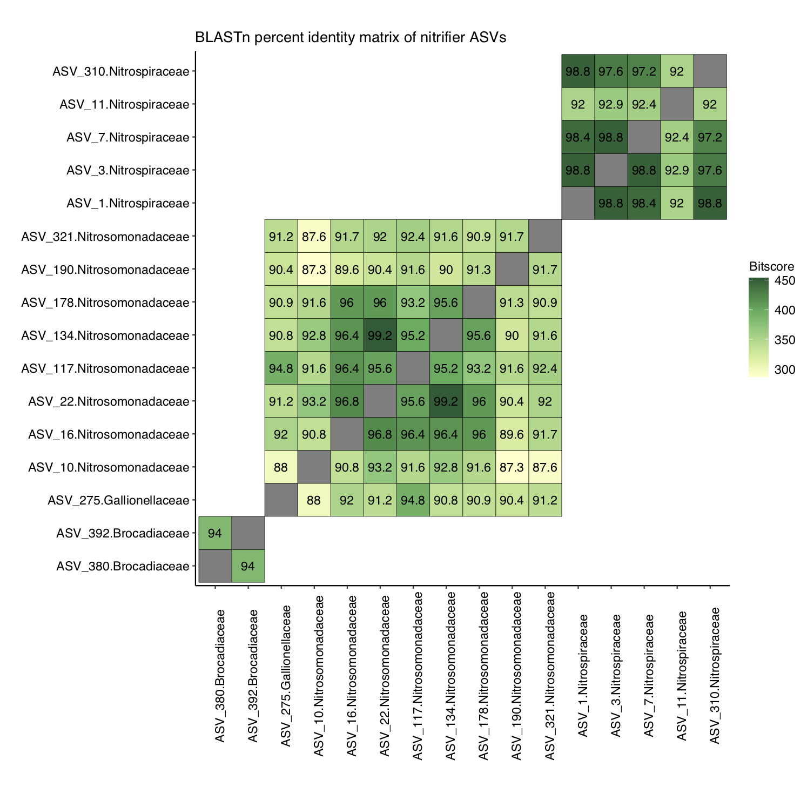
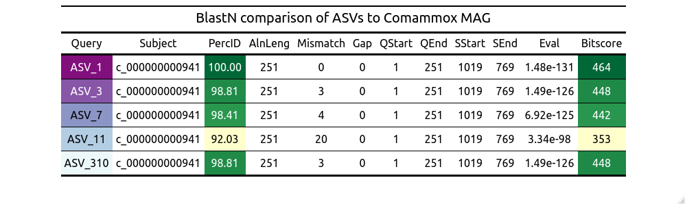
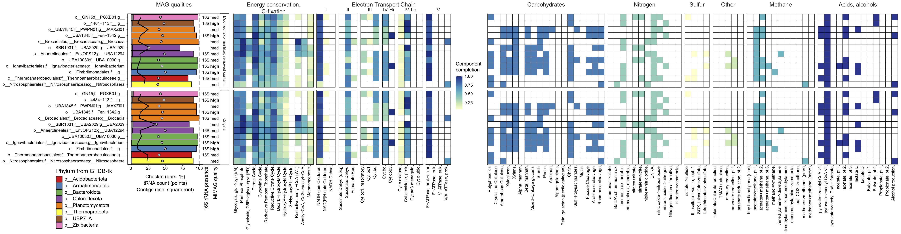

# In_progress

Figures that may or may never be published

#

Comammox in Japanese full-scale drinking water production plant: Amplicon seqeuncing was performed for two genes, one phylogenetic and one fucntional marker, over several time points during which operational parameters were varied. Additionally, paired end read sequencing data were generated at 3 time points, which were co-assembled, and a Comammox-like genomic bin was recovered and sub-assembled using reads in the final time point that mapped to the genome to create a higher-quality Metagenome-Assembled Genome (MAG). 

  -highly similar data or analyses incorporated into a manuscript currently *in review*

**Ammonia MonoOxygenase subunit A (amoA) gene Amplicon Sequence Variant (ASV) relative abundance heatmap**

legend

**16S rRNA gene Amplicon Sequence Variant (ASV) similarity with self matrix**

legend

**16S rRNA gene Amplicon Sequence Variant (ASV) similarity to metagenomic assembly**

legend

**COMplete AMMonia OXidizer (Comammox) genome read recruitment at different read similarity minimums compared between 2 different time points**

legend

**COMplete AMMonia OXidizer (Comammox) genome read recruitment similarities**

legend

Computational tool development: (1) Flag outlier contigs that may be mis-binned due to high MASH distance computed with Sourmash

**Tanglegram of fast Average Nucleotide Identity (fANI) and Sourmash distances for Nitrospira intra-genomic comparisons**

legend

Computational tool development: (2) Recreate DRAM outputs using R to allow both automated reproduction and modification (i.e. via R) and manual manipulation (i.e. via PDF editor)

  -code and key are available as
  
   and
  
  ; example input data are available as
  
  ,
  
  ,
  
  , and
  
  
  -data will be used for an *in prep* manuscript
  
  -compare to Fig. 3 in https://academic.oup.com/nar/article/48/16/8883/5884738

**Recreation and modification of DRAM output**

legend

