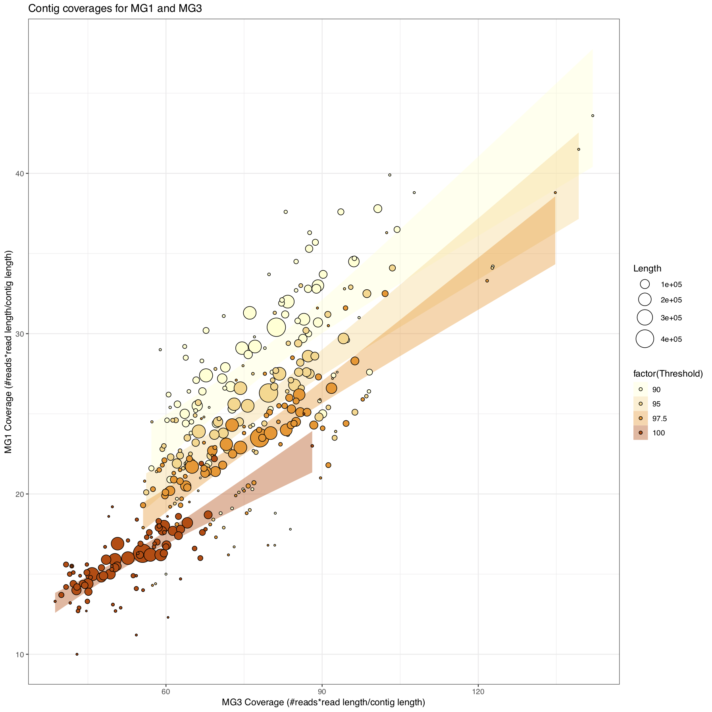

# In progress

Data and visualizations that may or may never be published

#

# Computational tool development

(1) Flag outlier contigs that may be mis-binned due to high MASH distance computed with Sourmash. Large-scale genomic comparisons are an increasingly frequent component of microbial research projects to put new genomes into context with its phylogenetic relatives; in the past this was done using physical hybridization of DNA or alingment of genomes with eachother, however neither of these scale to the vast quantities of microbial genomic data that are currently being produced and thus proxies using MinHash distance are becoming more popular. The 205 genomes repesenting the bacterial class Nitrospirae were downloaded from NCBI, and these genomes were compared to each other using two MinHash distance calculators, fastANI compares only orthologous regions and converts the MinHash distances into an aggregated alignment identity with a minimum threshold whereas Sourmash ignores orthology and produces only the MinHash distance, using the same k-mer value. The outputs of both programs were imported in to R for analysis and visualization.

**Tanglegram of fast Average Nucleotide Identity (fANI) and Sourmash distances for Nitrospira intra-genomic comparisons**

These dendrograms were produced by clustering of two different pairwise MinHash distance calculation programs. Using R, the dendrograms were displayed and lines were drawn between the same tips and arbitrarily colored if clades were composed of the same genomes (otherwise and singletons are gray) to show concordance between the distance algorithms. These data showed that (1) the distances themselves have functionally different ranges that could affect clustering algorithms, i.e. fastANI has minimum threshold of 70% or 0.7 and cannot make more distant comparisons, and (2) the programs were concordant for  some lineages but yielded different topologies for genomes that are more distant from all other membres of this broad phylogenetic group.

#

Computational tool development:

(2) Recreate DRAM outputs using R to allow both automated reproduction and modification (i.e. via R) and simple manual manipulation (i.e. via PDF editor). DRAM is an advanced computational program to estimate the quality and annotate the genes of microbial (and viral) genomes assembled from metagenomic data, and then create per-genome summarized datasets and visualizations, however it's primary visualization output is an HTML file, which is relatively inaccessible to novice to intermediate computational microbiologists compared to R due it's greater popularity and use (in my research groups at least). I created a script to mimic the output, and in my opinion options to improve the quality and accuracy of the output, with very few user-required adjustments, for example file inputs and choice of output, but also would allow users to adjust the data it shows, for example the taxon or assembly quality. In this example, a 12-genome dataset was shared from collaborators, and noticing some quality issues on the first pass through DRAM I decided to clean up the genomes and re-run DRAM. The outputs of DRAM were imported in to R for analysis and visualization.

  -code and key are available as
  
   and
  
  ; example input data are available as
  
  ,
  
  ,
  
  , and
  
  
  -data will be used for an *in prep* manuscript
  
  -compare to Fig. 3 in https://academic.oup.com/nar/article/48/16/8883/5884738

**Recreation and modification of DRAM output**

The x-axis is split into three sections: the addition of assembly quality compared to the original HTML output with genome completeness and contamination shown as bars, tRNA counts shown as points, sequence count indicated by lines, and presence of a 16S rRNA gene and thew inferred quality as text (left), major metabolic pathway as a heatmap of their completion based on the proportion of required genes that are present (middle), and presence/absence matrix of additional metabolic genes (right). The top and bottom are mostly duplicated, but the bottom genomes were provided by collaborators and the top genomes I cleaned up manually by removing obvious contaminant sequences applying a minimum sequnce length threshold. This visualization (1) offers an overview of quality and metabolic capabilities for the genomes, and (2) shows that my manual cleaning minimally affected the aggregate quality metrics or metabolism.

#
#
#

# Wastewater treatment plant-mimicking lab-scale bioreactors

A bioreactor was inoculated in 2015 from wastyewater treatment plant and guided into a tandem system (effluent from first is influent to second) to make nitrification more efficient by compartmentalizing the two major steps - ammonia oxidation and nitrite oxidation. A mixture of sequence data from various technolgies were collected, but only now are being analyzed for microbial community analysis to help contextualize biochemical measurements. When analzying metagenomic seqeuncing data, there are two major approaches - gene-cntric that focuses on marker genes agnostic of genomic context because high-quality genomes are much more difciult to recover than individdual marker genes, and genome-centric that focuses on reconstructing genomes as a more accurate representation of the microbial community and its members compared to a pool of genes - that have trade-offs between breadth, depth, ease, and accuracy of analyses and conclusions. In the top figure, marker genes were identified and used for read recruitment of multiple time points and compared to a database to determine their phylogenetic affiliation, and these data were put into R for analysis and visualization (gene-centric). In the bottom figure, logging info form numerous assemblies generated using diufferent programs and settings were mined for information on circularity and length, and these data were input into R for analysis and visualization (genome-cnetric).

**Co-variance network of marker genes in wastewater treatment mimcking bioreactor**

An abundance correlation network was calcualted for the coverage (read count per length sequence) over multiple time points of marker genes. Each point is one marker gene colored by a combination of taxonomy or inferred metabolism of interest and certain representatives are highlighted as diamonds, and the same network has been duplicated to show positive (both genes increase in abundance over time) and negative (one gene increases over time while the other decreases) correlations to examine the different dynamics of relationships of microbial community members. This analysis revealed that (1) there appears to be a major core group of microorganisms with complex, mixed positive and negative relationships, and (2) a cooperative cascade supports fringe members of the community.

#

**Recovery of circular assembled seqeunces via different assembly programs applied to long read seqeuncing data**

The x-axis is the length of contigs that assemblers described as circular. The y-axis is the interaction between assembler and setting. The two panels are faceted by the bioreactor origin of the data. Each point is one circular assembled sequence, colored by the interaction between assembler, setting, and bioreactor, essentially matching the y-axis and faceting, and jittered due to substantial overlapping. Horizontal lines indicate commmon length thresholds for virus (5 Kilo-basepairs) and microbial (1 Mega-basepairs) genomes, and the counts per assembler matching these criteria are displayed as text. One assembler does not supply length information and their lengths were set to these thresholds based on additional data (not shown) but were not known or summarized. These data showed that (1) assembler and setting have a major impact on the recovery (number and length) of circular assembled sequences.

#
#
#

# Genomic analyses of Brocadiae

Members of the microbial lineage Brocadiae are the only known bacteria capable fo ANaerobic AMMonia OXidation (anammox), however since these microorganisms tend to be difficult to work with an characterize, much of their physiology remains unclear and reliant on genomic predictions even for the major metabolic process such as anammox. One noteworthy mystery is the trnasformation(s) of an intermediate, nitrite, becuase the most common genes in other bacteria are well conserved and good indicators of this metabolism but this is not the case in Brocadiae. I downloaded Brocadiae genomes from NCBI based on their affiliation in the GTDB, and used DRAM to summarize assembly quality and annotate genes, and specifc genes of interest in nitrogen metabolism were confirmed by aligning to published references. Additionally, reconstrcution of a whole-genome phylogeny was automated using UBCG to find and align conserved genes, then concatnate them and build a tree. Dendrogram, assembly qualities, and alignment information were imported for analysis and visualization using R.

**Brocadiae phylogenetic and dissimilatory nitrogen metabolism overview**

The x-axis is split into three parts: left, a whole-genome phylogeny of the Brocadiae; middle, assembly quality for the genomes estimated from DRAM as bars and points; right, dissimilatory nitrogen metabolism gene summaries sized by the count of unique genes in the genome and colored by their mean similarity to the reference. The y-axis is the individual Brocadiae genomes color-coded by genus  and labelled with the most specific taxon available. This analysis confirms that (1) much of the dissimilatory nitrogen metabolism is poorly conserved at broad phylogenetic distance but much better and finer distance despite using the same overall metabolic pathway for energy conservation (ie between versus within the colors), and (2) that some of the lack of conservation may be due to lower quality assemblies that may be missing genes that are likely in the real, biological genome to support the metabolism.

#
#
#

# Comammox in Japanese full-scale drinking water production plant

An operational water treatment plant in Japan tested a variety of parameters (influent rate, residence time, copper addition, etc.) to identify the best balance of production and and nitrogen removal efficacy. Metagenomic sequencing data were generated at 3 time points, which were co-assembled, and a Comammox-like genomic bin was recovered and sub-assembled using reads in the final time point that mapped to the genome to create a higher-quality Metagenome-Assembled Genome (MAG). This MAG was used as a reference for further read recuitment analyses using all three time points and multiple read alignment thresholds. These data were input into R for analysis and visualization.

  -highly similar data or analyses incorporated into a manuscript currently *in review*

**COMplete AMMonia OXidizer (Comammox) genome read recruitment at different read similarity minimums compared between 2 different time points**

The x- and y-axes are the coverage (number of reads multiplied by the approximate read length, then divided by the reference seqeunce length) of metagenomic sequences grouped into a microbial genome from biomass collected at two time points (MG1 earlier, MG3 later and from which the sequences were assembled) as a proxy for the genome's abundance over time. Each bubble is a single reference sequence, which was sized according to its length to show any reference length bias (small references tend to be outliers and may be inaccurately grouped into the genome), and each reference is duplicated for multiple read identity (%) filters represented by the different shades of orange to show effects of this threshold on estimating coverage and estimate the contributions of similar (but not the same) populations that are also present in the bioreactor. Additionally, 95% confidence intervals are displayed to help highlight reference seqeunces that may be potential outliers within reasonable magnitudes of variance. These data suggested that (1) the genome is >3x more abundant in MG3 than MG1, (2) smaller contigs beyond the confidence intervals tend to be possible outliers to be removed, and (3) a separate, but related population similar to the genome of interest is present due to the large increases in coverage with lower identity thresholds.

#

**COMplete AMMonia OXidizer (Comammox) genome read recruitment similarities**

The x-axis is the position of a read aligned (calculated as the midpoint of the beginning and end of the alignment) to metagenomic sequences grouped into a microbial genome, which were ordered along the x-axis by decreasing length (and do not reflect real genomic positions between sequences), with the names of the sequences displayed to follow up on. The y-axis is the identity of the read compared to the reference sequence, and is split into three panels for each of three different sampled time points (MG1 first, MG2 second, MG3 third and from which the sequences were assembled). Each point represents a single read (randomly sub-sampled to 10% of the total), which is colored by the length of the alignment with the reference to reveal any bias by read length. Additionally, a horizontal line represents the mean of all reads per sample. These data indicated that (1) alignment length is not a major contributor to differences in read identity, (2) the genome of interest is becoming more dominant over similar populations given the overall increase in read identity from MG1 to MG2 to MG3, and (3) there may be certain sequences of interest due to high (dis)similarity with the rest of the population where much fewer reads are aligned. 

